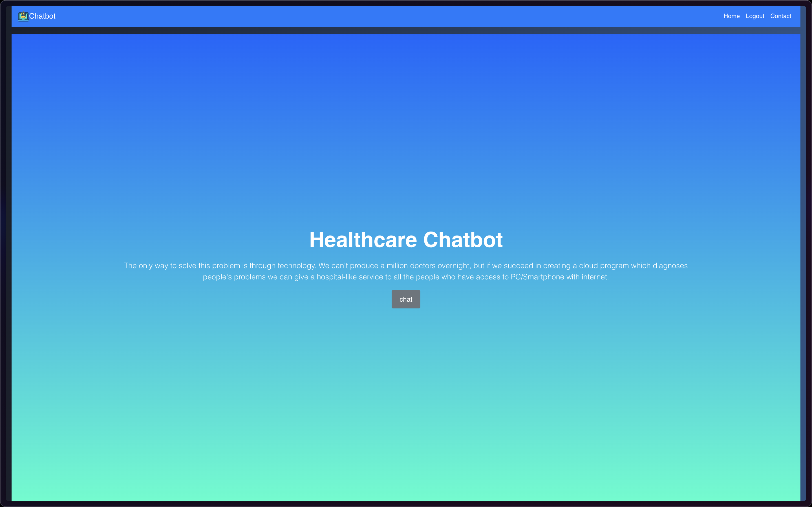
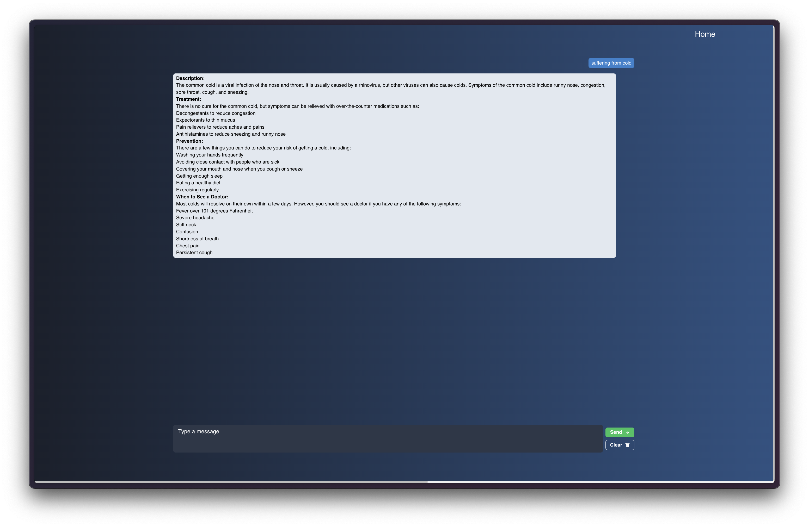

# Health Care Chat Bot

## Overview

Health Care Chat Bot is a web application designed to assist users with their healthcare-related queries and provide support in managing their health. The chatbot offers a range of features including symptom checking, appointment scheduling, and providing information on medications.

## Features

- Symptom Checker: Enter your symptoms to get potential diagnoses and recommendations.
- Appointment Scheduling: Easily schedule appointments with healthcare providers.
- Medication Information: Get detailed information about medications, including usage and side effects.
- Health Tips: Receive daily tips and advice to maintain a healthy lifestyle.

## Technologies Used

- Frontend: React.js
- Backend: Node.js, Express.js
- Database: MongoDB
- AI: Gemini API

## Project Structure

The project consists of two main folders:

- `client`: Contains the frontend code.
- `server`: Contains the backend code.

## Setup and Installation

1. Clone the repository:

   ```sh
   git clone https://github.com/kishantalekar/healthcare_chatbot.git
   ```

2. Navigate to the project directory:
   ```sh
   cd healthcare_chatbot
   ```

### Client Setup

3. Navigate to the `client` directory:

   ```sh
   cd client
   ```

4. Install the dependencies:

   ```sh
   npm install
   ```

5. Start the development server:
   ```sh
   npm run dev
   ```

### Server Setup

6. Navigate to the `server` directory:

   ```sh
   cd ../server
   ```

7. Install the dependencies:

   ```sh
   npm install
   ```

8. Start the server:
   ```sh
   npm start
   ```

## Screens

- **Home Screen**:
  

- **Chat Screen**:
  

## Contact Information

For any questions or support related to the project, please contact:

- LinkedIn: [Kishantalekar](https://www.linkedin.com/in/kishan-talekar-2613b8260/)
- Twitter: [Kishantalekar](https://x.com/KishanTalekar)
